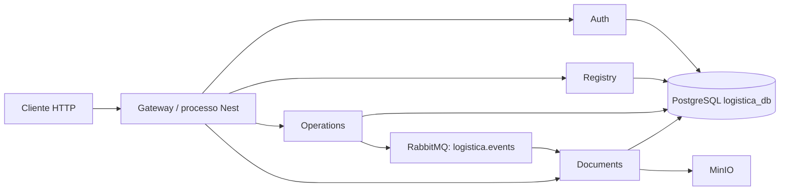
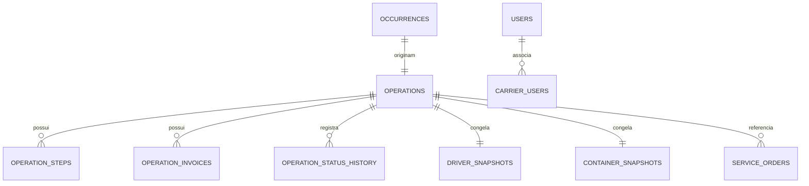

# Documentação técnica e funcional — Sistema HED

> Base: leitura estática do código TypeScript, entidades TypeORM, migrations e configuração presentes neste repositório em 20/09/2026. “Confirmado” significa que há implementação executável; não significa que a infraestrutura esteja disponível em produção. Onde o código não permite concluir algo, isto é declarado explicitamente.

## 1. Visão geral do sistema

O produto gerencia autenticação, cadastros de transportadoras/clientes/motoristas/veículos, operações logísticas, etapas, notas fiscais, ordens de serviço e documentos. A execução atual é um **monólito modular NestJS**: `gateway` importa os módulos de `auth-service`, `registry-service`, `operations-service` e `documents-service` e abre HTTP na porta `PORT` (3000 por padrão) e TCP interno em `MONOLITH_TCP_PORT` (3001 por padrão). Os nomes “service” e os `ClientProxy` TCP são contratos de transição; não há evidência, na configuração principal, de que sejam processos de domínio separados.



PostgreSQL é único (`logistica_db`, entidades carregadas automaticamente). MinIO armazena binários de documentos; RabbitMQ entrega eventos de operação para o consumidor de documentos. `docker-compose.yml` também expõe PostgreSQL 5432, MinIO 9000/9001 e RabbitMQ 5672/15672.

## 2. Arquitetura, módulos e configuração

| Limite de código | Responsabilidade confirmada | Interface/porta | Persistência/integrações |
|---|---|---|---|
| `gateway` | HTTP, CORS, `ValidationPipe` global, Swagger e adaptação HTTP→TCP | HTTP 3000; TCP 3001 no mesmo app | `ClientProxy` TCP para os módulos internos |
| `auth-service` | usuários, vínculo usuário-transportadora, JWT e auditoria | patterns TCP | `users`, `carrier_users`, `audit_logs`; consulta Registry |
| `registry-service` | cadastros e vínculos de transportadora | patterns TCP | entidades de cliente, motorista e veículo |
| `operations-service` | ocorrência, operação, etapas, NFs, estados, OS, importação e outbox | patterns TCP | tabelas `operations*`, snapshots e `outbox_events`; consulta Documents/Registry |
| `documents-service` | upload/listagem/download/remoção e projeção assíncrona | HTTP e patterns TCP | `documents`, `processed_events`, `operation_projections`; MinIO e RabbitMQ |

Configurações relevantes: `DB_*`/`DATABASE_URL`, `DB_SYNCHRONIZE`, `JWT_SECRET`, `JWT_EXPIRES_IN` (a configuração do gateway fixa 15m), `MINIO_*`, `RABBITMQ_URL`, `RABBITMQ_MAX_RETRIES`, `RABBITMQ_RETRY_DELAY_MS`, `OUTBOX_LOCK_TIMEOUT_MS`, `MAX_FILE_SIZE` e `CORS_ORIGIN`. Segredos não são reproduzidos aqui.

## 3. Comunicação entre módulos

| Origem | Destino/receptor confirmado | Transporte/pattern | Finalidade |
|---|---|---|---|
| Gateway AuthService | `auth-service/AuthController` | TCP `{cmd: register, login, refresh, logout, validate_user}` | autenticar e validar usuário |
| Gateway controllers de cadastro | controllers de `registry-service` | TCP `*_cliente`, `*_motorista`, `*_veiculo`, `*_transportadora` | CRUD e associações |
| Gateway OperationsController | `operations-service/OperationsController` | TCP `operations.*`, `occurrences.*`, `serviceOrder.*` | operações, busca, estados, NF e OS |
| AuthService | Registry TransportadorasController | TCP `find_one_transportadora_id` | preencher transportadoras vinculadas no login/token |
| OperationsService | Documents DocumentController | TCP `documents.byOperation` | verificar evidências documentais antes de transições |
| ServiceOrderService | Registry controllers | TCP de consulta de transportadora/cliente | compor dados da ordem/PDF |
| Operations outbox worker | Documents RabbitMqEventConsumer | RabbitMQ topic `logistica.events`, routing keys `operation.created`/`operation.updated` | projetar estado de operação em Documents |

O outbox grava o evento na mesma transação da criação/atualização de operação. O worker seleciona eventos não publicados com lock pessimista/`skip_locked`, publica confirmação RabbitMQ e marca `publishedAt`; falha incrementa `attempts` e mantém o evento pendente. O consumidor aceita somente envelope versão 1, origem `operations-service` e os dois tipos acima; registra o ID em `processed_events` para deduplicar e faz upsert ordenado por `occurredAt` em `operation_projections`. Falhas vão para exchange de retry (TTL configurável) e, após o limite padrão 3, para DLQ.

## 4. Inventário de endpoints HTTP

Todos os endpoints passam pelo `ValidationPipe` global (`whitelist`, `forbidNonWhitelisted`, `transform`). A coluna “fluxo” aponta para a cadeia terminal; detalhes dos fluxos críticos seguem abaixo.

| Método/rota | Controller → pattern/método terminal | Segurança observada |
|---|---|---|
| POST `/auth/register` | Gateway AuthController → `register` → AuthService.register | sem guard no gateway |
| POST `/auth/login` | → `login` → AuthService.login | sem guard |
| POST `/auth/refresh` | → `refresh` → AuthService.refresh | JWT |
| POST `/auth/logout` | → `logout` → AuthService.logout | **sem guard**; aceita `userId` no body |
| POST `/auth/me` | retorna `req.user` | JWT |
| GET/POST/PUT/DELETE `/clientes`, `/clientes/:id` | ClienteController → patterns de cliente → `ClientesService` | JWT + ADMIN/OPERATOR |
| GET `/clientes/cnpj-cpf/:cnpjCpf`, `/clientes/cnpj-cpfOff/:cnpjCpf` | busca por documento | JWT + ADMIN/OPERATOR |
| DELETE `/clientes/:id/hard` | exclusão definitiva | JWT + ADMIN/OPERATOR |
| GET/POST/PUT/DELETE `/transportadoras`, `/transportadoras/:id` | TransportadorasController → service/repositório | JWT + ADMIN/OPERATOR |
| GET `/transportadoras/id/:id`, `/transportadoras/cnpj/:cnpj`; DELETE `/:id/hard` | consultas/exclusão definitiva | JWT + ADMIN/OPERATOR |
| GET/POST/PUT/DELETE `/motoristas`, `/motoristas/:id`; GET `/motoristas/cpf/:cpf` | MotoristaController → service/repositório | JWT + ADMIN/OPERATOR |
| POST `/motoristas/:id/vincular`; DELETE `/motoristas/vinculo/:vinculoId` | vínculo motorista-veículo | JWT + ADMIN/OPERATOR |
| GET/POST/PUT/DELETE `/veiculos`, `/veiculos/:id` | VeiculoController → service/repositório | JWT + ADMIN/OPERATOR |
| GET/POST/PUT/DELETE `/users`, `/users/:id` | UsersController → UsersService | JWT + ADMIN/OPERATOR |
| POST `/users/linked/motorista` | cria motorista; cria usuário DRIVER; compensa motorista se usuário falhar | JWT + ADMIN/OPERATOR |
| POST `/users/add-carrier`; DELETE `/users/remove-carrier` | UsersService.vincular/desvincularTransportadora | JWT + ADMIN/OPERATOR |
| GET `/dashboard` | DashboardService → patterns de métricas | JWT |
| POST `/operations`, `/operations/simple`, `/operations/steps`, `/operations/occurrences` | OperationsController → `operations.*` | JWT; papéis devem ser verificados no controller concreto antes de depender deles |
| PUT `/operations/:id`; POST `/:id/transition`; GET `/:id/status-history` | update/transição/histórico | JWT |
| POST `/:id/invoices`; DELETE `/:operationId/invoices/:invoiceId` | set/remove NF | JWT |
| GET `/operations`; POST `/operations/search`; POST `/operations/import/excel` | busca/importação | JWT |
| GET `/mobile/motoristas/:motoristaId/operations|occurrences` | busca filtrada por motorista | JWT; DRIVER só acessa o próprio `motoristaId` |
| POST `/service-orders`; GET `/service-orders/operation/:operationId`; POST `/service-orders/:id/pdf` | `serviceOrder.*` | JWT |
| POST `/operations/documents/service-orders/generate` | gera PDF de OS | JWT |
| POST `/operations/documents/upload`; GET download/view/by-operation; DELETE `/:documentId` | proxy de Documents | JWT |
| POST `/documents/upload`; GET by-operation/`:documentId`/download/view; DELETE `/:documentId` | DocumentController → DocumentService | JWT |

Não foi possível confirmar pelo código analisado uma autorização por transportadora aplicada de maneira uniforme nos CRUDs e documentos; diversos handlers apenas exigem JWT/papel.

## 5. Rastreamento dos fluxos principais

### POST `/operations` — criação completa

1. `gateway/src/operations/operations.controller.ts` recebe DTO e usuário autenticado, e envia TCP `operations.createCompleteOperation`.
2. `operations-service/.../operations.controller.ts` chama `OperationsService.createCompleteOperation(dto, actor)`.
3. `createOccurrence` cria `occurrences` com origem, transportadora, instalações e status `PENDING_DRIVER`.
4. `createOperation` busca a ocorrência. Ausente: `NotFoundException`.
5. Para operação diferente de `TRANSFERENCIA`, se houver `carretaPlate`, consulta operações não finalizadas/canceladas com essa placa; encontrando uma, lança `NotFoundException` (mensagem de carreta em uso).
6. Gera número `OS-xxxxxx` lendo a última operação por `createdAt`; cria operação `Created`, snapshots de motorista/contêiner e, numa transação, salva ocorrência, operação e outbox `operation.created`.
7. `evaluateAutomaticTransitions` pode mover COLETA para `Collecting_Container` quando há `driverId` e cavalo/carreta; ou ENTREGA para `Picking_Up_Container` quando também há CT-e/MDF-e em campos ou documentos.
8. Para cada `steps[]`, `addStep` cria `operation_steps` com status inicial `PENDENTE`.
9. Retorna operação, etapas e ocorrência. A criação de ocorrência/operação é transacionada, mas a criação posterior de etapas não está na mesma transação.

Entidades: INSERT `occurrences`, `driver_snapshots`, `container_snapshots`, `operations`, `outbox_events`, e opcionalmente `operation_steps`.

### POST `/operations/:id/transition` — máquina de estados

1. Gateway inclui `operationId`, `TransitionOperationDto {toStatus, notes?}` e ator de `req.user` no pattern `operations.transition`.
2. Service busca operação com ocorrência/snapshots; confirma que a transportadora da ocorrência pertence a `actor.transportadoraIds` quando estes foram informados.
3. Cancelamento exige papel `ADMIN`, não permite cancelar `Finished` e exige motivo.
4. Para outros destinos, `getAllowedNextStatuses(tipo, atual)` precisa conter o destino. Em seguida, `validateTransitionRequirements` busca tipos de documento via Documents e valida campos específicos.
5. Em transação, atualiza `operations.status`, grava `operation_status_history` (estado anterior/novo, ator, data e notas) e cria outbox `operation.updated`; retorna a operação persistida.

Erros confirmados: operação inexistente; transportadora não autorizada; cancelamento não-admin, sem motivo ou pós-finalização; transição inválida; documentos/campos obrigatórios ausentes.

### POST `/documents/upload` — arquivo operacional

1. JWT é validado pelo Passport; `FileInterceptor('file')` entrega binário e `UploadDocumentDto`.
2. `DocumentService.validateFile` aceita somente PDF/JPEG/PNG/GIF/WebP, extensão compatível, arquivo não vazio e até `MAX_FILE_SIZE` (50 MiB padrão).
3. Exige `operationId` e `transportadoraId`; valida configuração e cria o bucket MinIO se necessário.
4. Gera nome aleatório de 16 bytes hex, grava o binário no bucket e salva metadados em `documents`.
5. Retorna metadados, não o binário. Download/view busca documento ativo, lê MinIO para buffer e muda apenas `Content-Disposition`. Delete marca `isActive=false`, salva e remove o objeto MinIO.

### POST `/auth/login` — autenticação

1. Gateway valida `LoginDto` e envia `{cmd:'login'}` por TCP.
2. Auth busca `users` pelo CPF normalizado (somente dígitos), rejeita usuário inexistente, `isDeleted` ou senha bcrypt inválida com 401.
3. Busca vínculos ativos em `carrier_users` e, para cada um, chama Registry para buscar a transportadora; falha nessa consulta é logada e o vínculo é omitido da resposta/token.
4. Assina access token e refresh token (7 dias), contendo `sub`, papel, motorista e transportadoras; aplica bcrypt ao refresh token, atualiza `lastLoginAt` e grava auditoria `LOGIN`.
5. `JwtStrategy` extrai Bearer token, chama `validate_user`, rejeita usuário apagado/inativo e combina IDs de transportadora atuais e do token.

## 6. Regras de negócio comprovadas

| ID | Regra / implementação |
|---|---|
| AUTH-001 | CPF é normalizado para dígitos antes de criar, localizar ou atualizar usuário (`AuthService`, `UsersService`). |
| AUTH-002 | Login rejeita usuário removido ou senha inválida; a senha é bcrypt com custo 10 (`AuthService.login/register`). |
| AUTH-003 | Refresh depende de comparação bcrypt com o refresh token armazenado; logout o substitui por string vazia (`refresh/logout`). |
| REG-001 | Ao criar cliente com documento existente, cria/reativa somente o vínculo com a transportadora em vez de duplicar o cliente (`ClientesService.create`). |
| REG-002 | Vínculos de usuário-transportadora são reativáveis por soft delete (`UsersService.vincularTransportadora`). |
| OP-001 | Carreta não pode participar de outra operação ativa, exceto que a validação é pulada para `TRANSFERENCIA` (`validateCarretaAvailability`). |
| OP-002 | Status não pode ser alterado por update comum; deve usar a transição (`updateOperation`). |
| OP-003 | Cancelamento é exclusivo de ADMIN, requer motivo e é vedado após finalização (`transitionOperation`). |
| OP-004 | COLETA inicia automaticamente ao haver motorista + cavalo + carreta; com contêiner e evidências `CONTAINER_PHOTO` e `PICKUP_TICKET`, passa a trânsito ao cliente. |
| OP-005 | ENTREGA inicia retirada automaticamente somente com motorista/veículos e CT-e+MDF-e, por números ou documentos. |
| OP-006 | Antes de determinados destinos, são exigidos documentos/campos: coleta→trânsito exige foto/ticket; carregado exige NF ou documento NF; entrega ao porto exige CT-e, MDF-e e agendamento; finalização exige ticket de entrega. Para entrega, retirada exige motorista/veículos/CT-e/MDF-e, trânsito exige ticket e descarregado exige recibo assinado+CT-e. |
| DOC-001 | Documento é aceito somente nos MIME/extensões e tamanho permitidos; o registro excluído fica inativo e o objeto MinIO é removido. |

## 7. Estado da operação e etapas

Os valores do enum são: `Created`, `Collecting_Container`, `Picking_Up_Container`, `Collected`, `In_Transit`, `In_Transit_To_Client`, `At_Client`, `Loading`, `Loaded`, `Unloading`, `Unloaded`, `Port_Scheduled`, `Port_Delivery`, `Delivering`, `Returning`, `Finished`, `Cancelled`.

```mermaid
stateDiagram-v2
  [*] --> Created
  Created --> Collecting_Container: COLETA, motorista+veículos
  Collecting_Container --> In_Transit_To_Client: contêiner + foto + ticket
  Created --> Picking_Up_Container: ENTREGA, motorista/veículos + CT-e/MDF-e
  Created --> Port_Scheduled: TRANSFERENCIA (fluxo manual)
  Collecting_Container --> In_Transit_To_Client --> At_Client --> Loading --> Loaded --> Port_Delivery --> Finished
  Picking_Up_Container --> In_Transit --> At_Client --> Unloading --> Unloaded --> Finished
  Port_Scheduled --> Finished
  Created --> Cancelled
```

O diagrama resume os caminhos declarados em `getAllowedNextStatuses`; o método também contém mapeamentos de estados legados (`Collected`, `Delivering`, `Returning`). `Cancelled` é aceito como caminho especial pelas regras de cancelamento. As etapas têm `stepOrder`, local, agendamentos/tempos de portaria/doca/embarque, porto/booking/navio, volumes e observação; `addStep` exige operação existente e grava status `PENDENTE`. Não foi encontrada implementação para iniciar, concluir, cancelar ou impor ordenação/dependência entre etapas.

## 8. Entidades e banco

| Tabela | Chave e campos/relacionamentos relevantes |
|---|---|
| `users` | UUID; CPF, senha/refresh hash, papel/status, `motoristaId`, remoção lógica; 1:N `carrier_users` |
| `carrier_users` | UUID; `userId`, `transportadoraId`, `isDeleted`; N:1 usuário |
| `audit_logs` | auditoria de REGISTER/LOGIN/LOGOUT confirmada |
| `clientes` / `carrier_clients` | cliente e vínculo transportadora-cliente, com remoção lógica no vínculo |
| `motoristas`, `veiculos` | cadastros Registry; tabelas de vínculo motorista-veículo e vínculos com transportadora também existem |
| `occurrences` | UUID; origem, status, IDs da transportadora/origem/destino; 1:1 operação |
| `operations` | UUID; número único, status/tipo enum, ocorrência, snapshots 1:1, instalações, CT-e/MDF-e, agendamento/transferência, 1:N etapas/NFs/histórico |
| `driver_snapshots`, `container_snapshots` | cópias da designação de motorista/veículos e dados do contêiner, não FKs para Registry |
| `operation_steps` | UUID; N:1 operação; ordem, local, datas, status enum, dados portuários e observação |
| `operation_invoices` | UUID; N:1 operação, NF/chave; índice único `(operationId, invoiceNumber, invoiceKey)` |
| `operation_status_history` | UUID; N:1 operação; de/para, ator, data, notas |
| `service_orders` | UUID; N:1 operação e etapa; número OS, URL PDF, `printedAt` |
| `outbox_events` | UUID; envelope, publicação, tentativas e lock |
| `documents` | UUID; operação/transportadora, nome/caminho MinIO/tipo/tamanho/descrição/tipo documental, timestamps, `isActive` |
| `processed_events` / `operation_projections` | idempotência de evento e projeção de operação para Documents |



## 9. Documentos, ocorrências e ordens

Tipos documentais são definidos no enum compartilhado; a operação os consulta para bloquear transições. O módulo implementa upload genérico, não emissão fiscal: **não foi possível confirmar pelo código analisado emissão de CT-e, MDF-e ou NF-e**, nem integração fiscal externa. Há geração de PDF de ordem de serviço em `ServiceOrderService` e atualização de `pdfUrl`; o binário/URL exatos dependem do método de geração, mas a entidade armazena somente URL. Ocorrência é criada isoladamente ou como primeira parte da criação completa, mantém origem/instalações/transportadora e inicia `PENDING_DRIVER`; não foi encontrada mudança de status de ocorrência quando a operação avança.

## 10. Matriz de rastreabilidade resumida

| Funcionalidade | Entrada | Consumer/service | Persistência/efeito |
|---|---|---|---|
| Login | POST `/auth/login` | `login` → `AuthService.login` | SELECT/UPDATE `users`; SELECT `carrier_users`; INSERT `audit_logs`; JWT |
| Cadastro de cliente | `/clientes` | `create_cliente` → `ClientesService.create` | INSERT/SELECT `clientes`, `carrier_clients` |
| Criar operação | POST `/operations` | `operations.createCompleteOperation` → OperationsService | INSERT ocorrência/operação/snapshots/outbox/etapas |
| Transicionar | POST `/:id/transition` | `operations.transition` → OperationsService | UPDATE operação; INSERT histórico e outbox; consulta Documents |
| NFs | POST/DELETE invoices | `operations.setInvoiceData/removeInvoice` | INSERT/DELETE `operation_invoices` |
| Documento | POST `/documents/upload` | `DocumentService.uploadDocument` | PUT MinIO; INSERT `documents` |
| Projeção | evento RabbitMQ | `RabbitMqEventConsumer` | INSERT `processed_events`; INSERT/UPDATE `operation_projections` |

## 11. Riscos técnicos encontrados

| Severidade | Evidência e impacto |
|---|---|
| CRÍTICO | `POST /auth/logout` não usa guard e aceita `userId` do body; qualquer cliente que conheça um UUID pode invalidar a sessão desse usuário (`gateway/auth/auth.controller.ts`). |
| ALTO | `JwtStrategy` possui fallback literal para segredo quando `JWT_SECRET` não existe. Em ambiente mal configurado, isso cria uma chave previsível (`gateway/auth/jwt.strategy.ts`). |
| ALTO | Upload/listagem/download/remoção de documentos requer JWT, mas não verifica no código se o usuário pertence à `transportadoraId`/operação solicitada; risco de acesso horizontal. |
| ALTO | `createCompleteOperation` grava ocorrência/operação em transação e cria etapas depois, fora dela; uma falha deixa operação sem todas as etapas solicitadas. |
| ALTO | `generateOperationNumber` lê a última OS e soma um. Chamadas concorrentes podem gerar o mesmo número e falhar no índice único ou exigir retry. |
| MÉDIO | O gateway usa TCP interno para módulos no mesmo processo, mas ClientProxy não define timeout; indisponibilidade/erro pode deixar requisição pendente até comportamento padrão do transporte. |
| MÉDIO | Em `DocumentService.deleteDocument`, banco é marcado inativo antes de remover MinIO e não há compensação; falha no storage deixa metadado inativo e objeto órfão. Upload também não compensa objeto se INSERT falhar. |
| MÉDIO | `AuthService.register` grava usuário e auditoria sem transação; falha na auditoria pode retornar erro após criar usuário. |
| BAIXO | Contratos e comentários ainda descrevem microsserviços, enquanto `AppModule` importa todos no processo único; pode induzir operação/deploy incorreto. |

## 12. Funcionalidades não confirmadas e resumo executivo

Não foram confirmados: processos independentes para cada “service” no modo principal, cache, Kafka/Redis, notificações a usuário, CT-e/MDF-e/NF-e fiscais, impressão física, alteração de estado de etapa, resolução de ocorrência, ou autorização por tenant uniforme.

Em resumo, há um núcleo funcional de logística com estados por tipo de operação, evidências documentais obrigatórias, snapshots para preservar a alocação, e integração assíncrona confiável por outbox para projeção de documentos. O risco prioritário é reforçar autorização (logout e isolamento por transportadora), eliminar segredo JWT de fallback e fechar as lacunas transacionais/concorrência da criação de operações.
